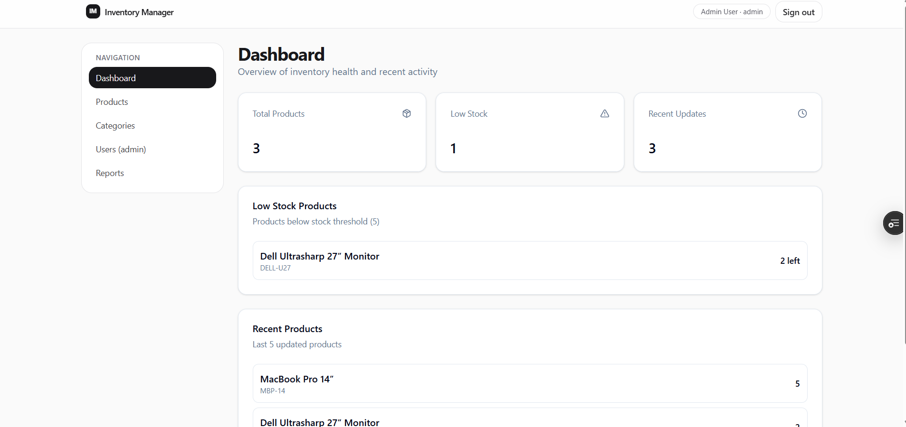
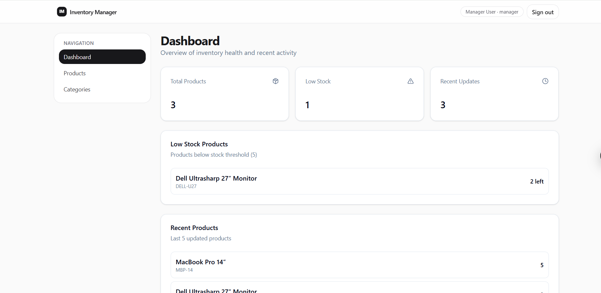
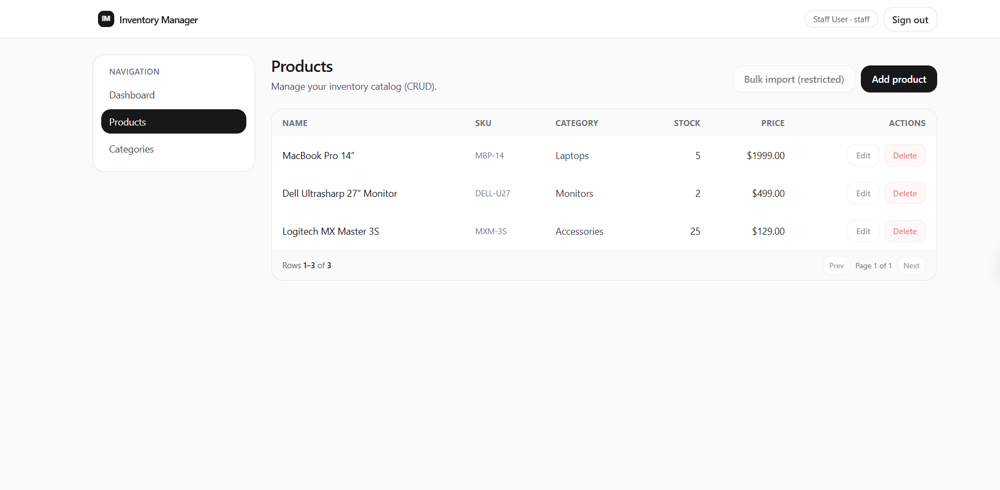
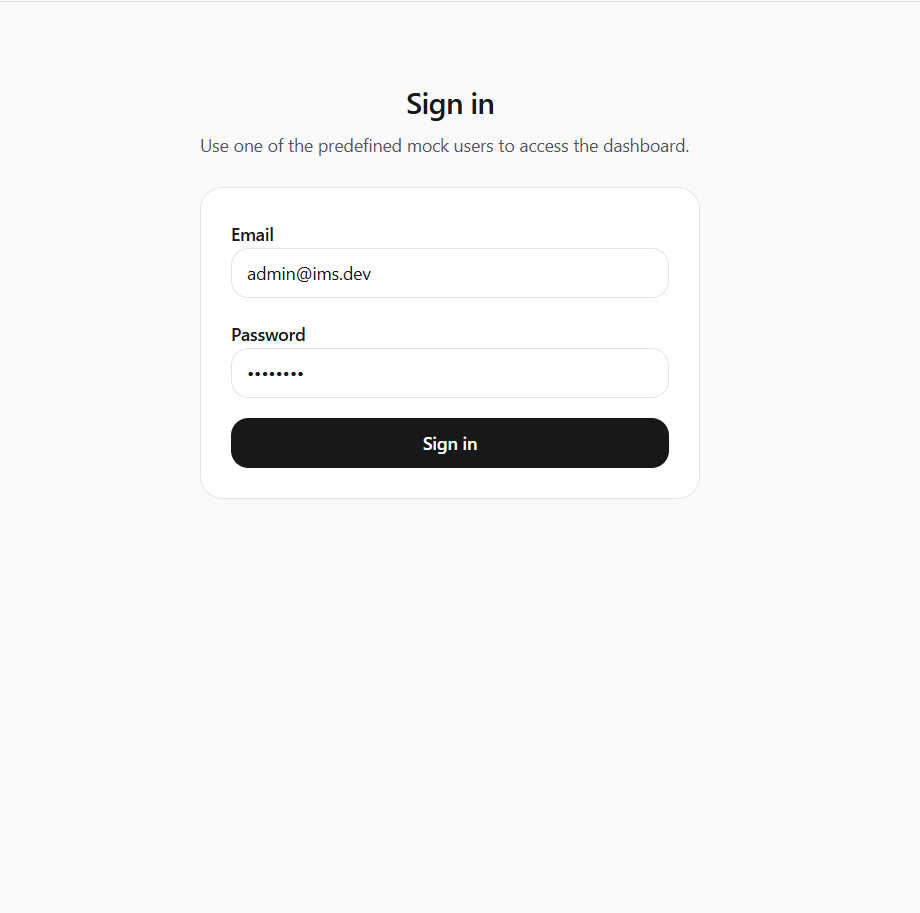
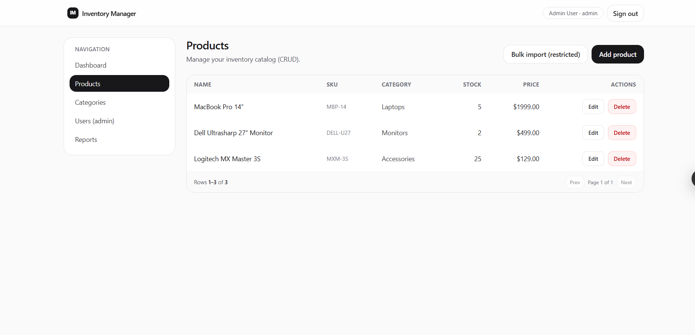
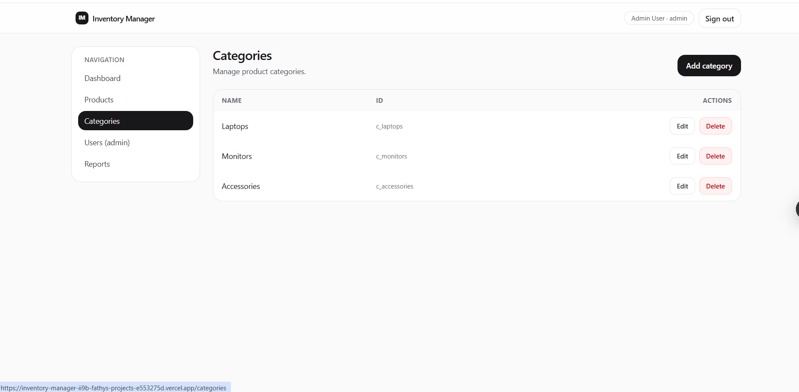
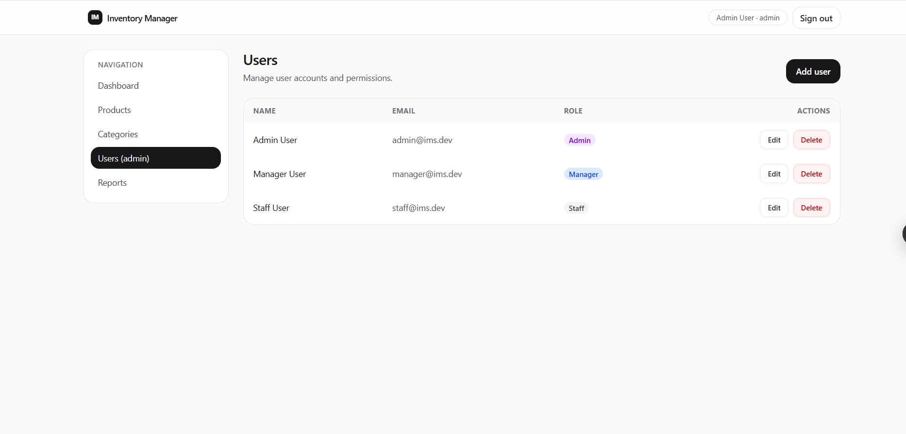
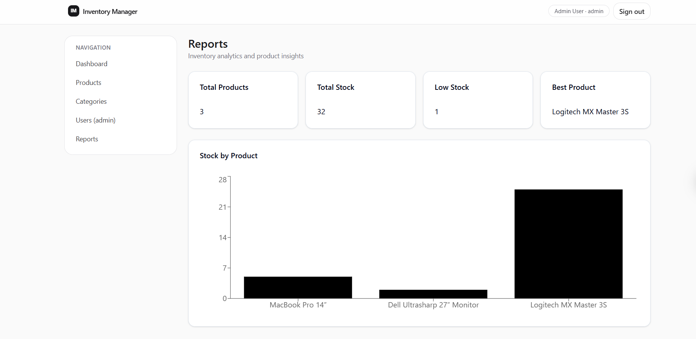

# 📦 Inventory Management System

A full-stack Inventory Management web application built using **Next.js**, designed to manage products, track inventory, and visualize business data in a clean and efficient dashboard.

---

## 🚀 Features
- 🔐 Authentication system (Login / Signup) using NextAuth  
- 📦 Product management (Add / Edit / Delete)  
- 👥 Role-based access control  
- 📊 Interactive dashboard with analytics  
- 📈 Data visualization using charts (Recharts)  
- 🧾 Export data to Excel and PDF (XLSX & jsPDF)  
- 📝 Form handling with validation (React Hook Form + Zod)  
- ⚡ Global state management using Redux Toolkit  
- 📱 Fully responsive UI  

---

## 🛠️ Tech Stack
- Next.js  
- React.js  
- Redux Toolkit  
- NextAuth.js  
- Tailwind CSS  
- React Hook Form  
- Zod  
- Recharts  
- XLSX  
- jsPDF  
- Radix UI  

---

## 📸 Screenshots

### Dashboard




### Authentication



### Product Management


### Categories Management


### Users Management


### Analytics



---
live demo :
https://inventory-manager-ii9b-fathys-projects-e553275d.vercel.app/

## ⚙️ Installation

```bash
git clone https://github.com/FATHYat7/inventory-manager
cd inventory-manager
npm install
npm run dev